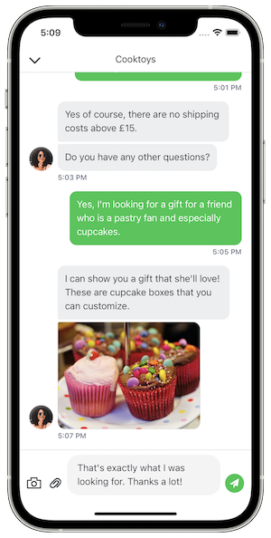

# iAdvize - iOS Conversation SDK

Take your app to the next step and provide a unique conversational experience to your users!

Embed the iAdvize Conversation SDK in your app and connect your visitors with your professional operators or ibbü experts through a fully customised chat experience. Visitors can ask a question and will receive answers directly on their devices with push notifications, in or outside your app.



You will find an example of integration in the ` Example/IAdvizeSwiftExample` folder of this repository.

Just run `pod install`, open the `IAdvizeSwiftExample.xcworkspace` and run the project. You can copy and paste the `Podfile` into your project to easily test it into your app.

## Requirements

The iAdvize iOS SDK requires iOS 12.0 or higher, and Xcode 12.5.

## Documentation

The API reference is available [here](https://iadvize.github.io/iadvize-ios-sdk/).

## Setup

### App creation

1. Ask your iAdvize Admin to create a **Mobile App** on the administration website. *If you want to enable the iAdvize SDK push notifications for your user you have to provide your APNS push certificate when you create your app on the administration website.*

2. Ask your iAdvize Admin to create a new **Web & Mobile App** targeting campaign on the administration website and to give you the following information:
    - **projectId**: id of your project
    - **targetingRuleId(s)**: one or multiple rules which you will be able to activate in code during the user navigation (see [Targeting](#Targeting)).

## Installation

### CocoaPods

The SDK is distributed as an XCFramework, therefore **you are required to use CocoaPods 1.9.0 or newer**.

Add this line to your Podfile, inside the target section:

```ruby
pod 'iAdvize', '2.2.2'
```

Add the following to the bottom of your Podfile:

```ruby
post_install do |installer|
    installer.pods_project.targets.each do |target|
        target.build_configurations.each do |config|
            config.build_settings['BUILD_LIBRARY_FOR_DISTRIBUTION'] = 'YES'
        end
    end
end
```

> This post_install hook is required because the iAdvize SDK supports [module stability](https://swift.org/blog/abi-stability-and-more/). Therefore, all its dependencies must be built using the "Build Libraries for Distribution" option.

Final shape of your Podfile should be:

```ruby
platform :ios, '12.0'
use_frameworks!
inhibit_all_warnings!

target 'YOUR_TARGET' do
    project 'YOUR_PROJECT'

    pod 'iAdvize', '2.2.2'
end

post_install do |installer|
    installer.pods_project.targets.each do |target|
        target.build_configurations.each do |config|
            config.build_settings['BUILD_LIBRARY_FOR_DISTRIBUTION'] = 'YES'
        end
    end
end
```


## Usage

### Activation

To activate the SDK you must use the **activate** function. You also have access to a asynchronous callback in order to know if the SDK has been successfully activated (and to retry later if the activation fails):

```swift
IAdvizeSDK.shared.activate(projectId: projectId,
                           authenticationOption: .simple(userId: userId),
                           gdprOption: .enabled(option: .legalInformation(url: legalInfoURL))) { success in
    if success {
        ...      
    }
}
```

Once the iAdvize Conversation SDK is successfully activated, you should see a success message in the console:

```
✅ iAdvize conversation activated, the version is x.x.x.
```

Do not forget to [logout](#Logout) when the user is no longer connected in your app.

##### GDPR

By default, when you activate the SDK, the GDPR will be disabled. 

To enable it, you can pass a GDPR option while activating the SDK. This GDPROption dictates how the SDK behaves when the user taps on the “More information” button:

1. `GDPROption.enabled(option: .legalInformation(url: URL))`: will open the given URL containing GDPR information
2. `GDPROption.enabled(option: .delegate(delegate: GDPRDelegate))`: will call the given delegate so that your app can show the relevant GDPR information

The GDPR process is now activated for your users and a default message will be provided to collect the user consent. Please check the [Customization](#Customization) section below if you want to customise this message.

#### Logging

By default, the SDK will **only log Warnings and Errors** in the Xcode console. You can make it more verbose and choose between multiple levels of log for a better integration experience:

```swift
 IAdvizeSDK.shared.logLevel = .verbose
```

### Targeting

The targeting process is managed by the `IAdvizeSDK.shared.targetingController`

#### Targeting Language

By default, the SDK will use the device language for **targeting a conversation**. With this variable you can specify the language you want to use for targetting:

```swift
IAdvizeSDK.shared.targetingController.language = .custom(value: .fr)
```

> :warning: This `language` property is NOT intended to change the language displayed in the SDK.

#### Activate a targeting rule

For the iAdvize SDK to work, you have to setup an active targeting rule. To do so, you can call the following method:

```swift
IAdvizeSDK.shared.targetingController.activateTargetingRule(targetingRuleId: UUID)
```

#### Targeting rule availability

The targeting rule availability check will be triggered when you update the active targeting rule (see [Activate a targeting rule](#rule))

You can check the active rule availability by accessing:

```swift
IAdvizeSDK.shared.targetingController.isActiveTargetingRuleAvailable
```

Or if you want to be informed of rule availability updates, you can add a delegate:

```swift
extension IntegrationApp: TargetingControllerDelegate {
    func activeTargetingRuleAvailabilityDidUpdate(isActiveTargetingRuleAvailable: Bool) {
    }
}
```

#### Follow user navigation

To allow iAdvize statistics to be processed you need to inform the SDK when the user navigates through your app. To do so, just call:

```swift
IAdvizeSDK.shared.targetingController.registerUserNavigation()
```

### Conversation

The lifecycle of the conversation is managed by the `IAdvizeSDK.shared.conversationController`.

#### Ongoing conversation

To know and to observe the evolution of the conversation state, you will have access to a variable:

```swift
IAdvizeSDK.shared.conversationController.hasOngoingConversation
```

You can also add a delegate to be informed in real time about conversation events:

```swift
extension IntegrationApp: ConversationControllerDelegate {
    func ongoingConversationStatusDidChange(hasOngoingConversation: Bool) {
        // SDK ongoing conversation status changed to hasOngoingConversation
    }

    func didReceiveNewMessage(content: String) {
        // A new message was received via the SDK
    }

    func conversationController(_ controller: ConversationController, shouldOpen url: URL) -> Bool {
        // A message link was tapped, return true if you want your app to handle it
    }
}
```

### Push notifications

The entry point for push notifications is the `IAdvizeSDK.shared.notificationController`

#### Configuration

To receive push notification when a message is sent to the visitor, you must register the current **push token** of the device:

```swift
IAdvizeSDK.shared.notificationController.registerPushToken("the_device_push_token", applicationMode: .prod)
```
You can register your push token at any time.

By default, push notifications are activated if you have setup the push notifications information for your app on the iAdvize administration website. You can manually enable/disable them at any time using:

```swift
IAdvizeSDK.shared.notificationController.enablePushNotifications { success in
	...
}

IAdvizeSDK.shared.notificationController.disablePushNotifications { success in
	...
}
```

#### Reception

Once you receive a push notification, you can easily verify that this notification concerns the SDK:

```swift
func application(_ application: UIApplication,
                 didReceiveRemoteNotification userInfo: [AnyHashable: Any],
                 fetchCompletionHandler completionHandler: @escaping (UIBackgroundFetchResult) -> Void) {
    if IAdvizeSDK.shared.notificationController.isIAdvizePushNotification(with: userInfo) {
        // ...
    }
}
```
### Chatbox

The Chatbox is where the conversation takes place. The visitor can open the Chatbox by touching the Chat button.

You can control the appearance and behavior of the Chatbox and Chat button using the `ChatboxController`, that you can access using `IAdvizeSDK.shared.chatboxController`.

#### Chat button

When the active targeting rule is available, a chat button is displayed to invite the user to chat.

You can decide to let the SDK manage the chat button visibility or control it yourself using the following flag:

```swift
IAdvizeSDK.shared.chatboxController.useDefaultChatButton = true
```

##### Default chat button
If `useDefaultChatButton == true` the SDK will use the iAdvize default chat button, manage its visibility, and open the chatbox when user presses it.

The default chat button is anchored to the bottom-left of your screen, you can change its position using:

```swift
IAdvizeSDK.shared.chatboxController.setChatButtonPosition(leftMargin: Double, bottomMargin: Double)
```

##### Custom chat button
If `useDefaultChatButton == false` this default button will not be displayed and it is your responsibility to:

- design your own custom floating or fixed button to invite your user to chat
- hide/show your button following the active [Targeting rule availability](#Targeting rule availability)
- open the chatbox when the user presses your button, using the following method:

```swift
IAdvizeSDK.shared.conversationController.presentConversationViewModal(animated: Bool, presentingViewController: UIViewController?) {
    // ...
}
```

N.B. Before showing your custom chat button, you have to ensure that there is operator availability first. Please check the [Targeting rule availability](#targeting-rule-availability) section in the [Targeting](#targeting) chapter.

#### Customization

You can customize the chatbox UI by calling the following method:

```swift
IAdvizeSDK.shared.chatboxController.setupChatbox(configuration: ChatboxConfiguration)
```

A simple snippet to only change one value:

```swift
var configuration = ChatboxConfiguration()
configuration.mainColor = .blue
```

The `ChatboxConfiguration` allow you to customize the following attributes:

##### Main color

You can setup a main color on the SDK which will be applied to the color of:

- the default Chat button (if you use it)
- the send button in the Conversation View
- the blinking text cursor in the “new message” input in the Conversation View
- the background color of the message bubbles (only for sent messages)

```swift
configuration.mainColor = .red
```

##### Navigation bar

You can configure the Toolbar of the Chatbox and modify:

- the background color
- the main color
- the title

```swift
configuration.navigationBarBackgroundColor = .black
configuration.navigationBarMainColor = .white
configuration.navigationBarTitle = "Conversation"
```

##### Font

You can update the font used in the UI of the IAdvize Conversation SDK. You just have to call this method to setup your own font:

```swift
configuration.font = UIFont(name: "AmericanTypewriter-Condensed", size: 11.0)
```

##### Automatic message

A first automatic message can be setup to be displayed as an operator message in the Chatbox. By default, no message will be displayed. This message will also be used and displayed when the user accepts the GDPR. You can set an automatic message through:

```swift
configuration.automaticMessage = "Hello! Please ask your question :)"
```

##### GDPR message

If you want to activate the GDPR consent collect feature through the iAdvize Conversation SDK, please refer to the [GDPR section](#gdpr).

Once the GDPR is activated, you can easily customise the GDPR message you want to display to your users to collect their consent:

```swift
configuration.gdprMessage = "Your own GDPR message."
```

##### Brand avatar

You can update the brand avatar displayed for the incoming messages. You can specify an URL or a Drawable. Gifs are not supported.

```swift
// Update the incoming message avatar with a `UIImage`.
configuration.incomingMessageAvatar = .image(image: UIImage(named: "BrandAvatar"))

// Update the incoming message avatar with a `URL`.
configuration.incomingMessageAvatar = .url(url: avatarUrl)
```

### Transaction

You can register a transaction within your application using the `IAdvizeSDK.shared.transactionController`:

```swift
let transaction = Transaction(externalTransactionId: "transactionId", date: Date(), amount: 500.0, currency: .eur)

IAdvizeSDK.shared.transactionController.registerTransaction(Transaction)
```

### Logout

When the user is logged out in your app, you need to log out in the iAdvize SDK as well to ensure the privacy of the user data and conversations.

```swift
IAdvizeSDK.shared.logout()
```

This will clear all the locally stored visitor data.

## And you’re done! 💪

Well done! You’re now ready to take your app to the next step and provide a unique conversational experience to your users! 🚀